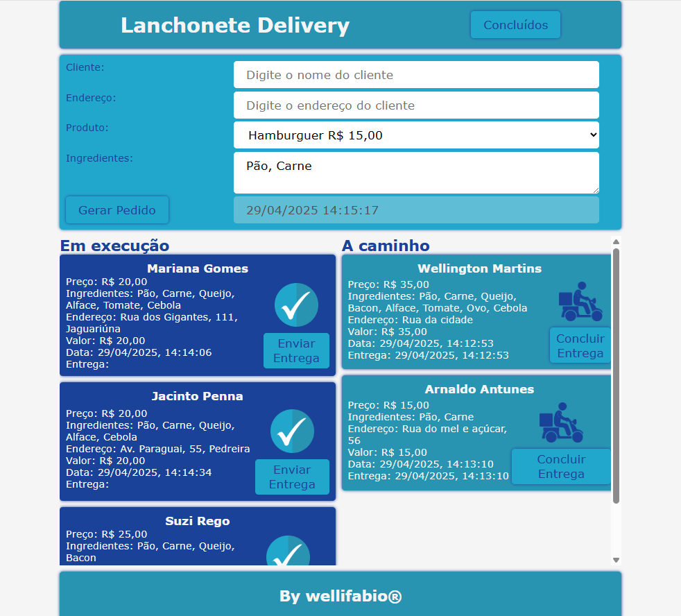
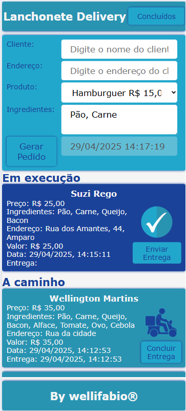
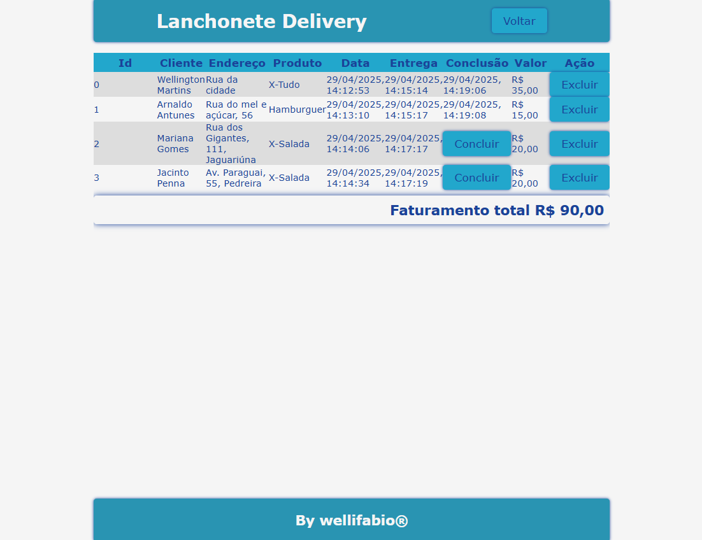
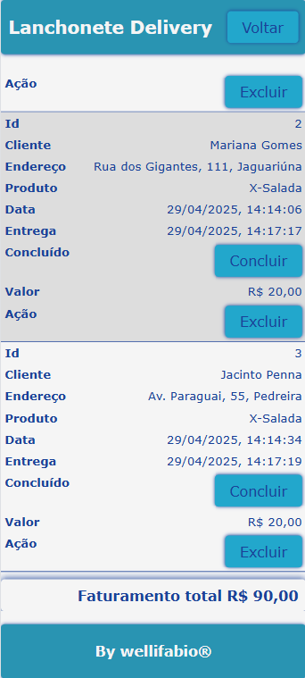

# Lanchonete Delivery
Situação de Aprendizagem - Front-End (HTML, CSS, JavaScript). Funcionalidades (Localstorage, Modal e responsividade).

## Configurações
- Fonte: Verdana, Geneva, Tahoma, sans-serif;
- Paletta de cores
- [ ] cor1: #1A4299;
- [ ] cor2: #2994B2;
- [ ] cor3: #22A7CC; 
- [ ] cor4: #DDDDDD;
- [ ] cor5: #F5F5F5;
- [ ] transp1: rgba(0, 0, 0, 0.8);
- [ ] transp2: rgba(255, 255, 255, 0.8);

## Requisitos funcionais
- [RF001] Cadastro de pedidos - Conforme o wireframe a seguir, o usuário deve conseguir cadastrar um pedido, informando os dados do cliente e o produto desejado esclhendo entre os produtos disponíveis na lanchonete em um **select** do HTML.
    - [RF001.1] O sistema deve registrar a data e a hora do pedido a ser cadastrado.
- [RF002] Listagem de pedidos - O sistema deve listar os pedidos cadastrados, conforme o wireframe a seguir. A listagem deve ser feita em formato de cards conforme o wireframe.
    - [RF002.1] Os cards dos pedidos em execussão devem possuir um ícone que ao sert clicado o pedido deve ser movido para a coluna de pedidos em entrega.
    - [RF002.2] Os cards dos pedidos em entrega devem possuir um ícone que ao ser clicado o pedido deve ser movido para um localStorage e mostrado na página de pedidos finalizados.

|Web|Mobile|
|-|-|
|||
|||
- [RF003] Responsividade - O sistema deve ser responsivo, ou seja, deve se adaptar a diferentes tamanhos de tela. O sistema deve ser testado em dispositivos móveis e desktops para garantir que a interface do usuário seja exibida corretamente em todos os dispositivos.
- [RF004] Tela de **pedidos concluídos** - O sistema deve ter uma tela de pedidos finalizados, onde o usuário pode visualizar os pedidos que foram entregues. A tela deve ser acessada através de um botão na tela principal **Concluídos**.
    - [RF004.1] A tela deve exibir os pedidos **finalizados e a caminho** em formato tabela responsiva conforme o wireframe a seguir, com um botão para **concluir** os pedidos a caminho.
    - [RF004.2] O **faturamento total** dos pedidos deve ser calculado e mostrado nesta tela, conforme wireframe.

|Web|Mobile|
|-|-|
|||

## Entrega
A atividade deve ser entregue pelo gitpages (OBRIGATÓRIO).
Como foi feito fork, cole o link do git pages na aba About do seu repositório original.

### A seguir os dados para os lanches

```json
[
    {
        "id": 1,
        "nome":"Hamburguer",
        "ingredientes": [
            "Pão",
            "Carne"
        ],
        "preco": 15.00
    },
    {
        "id": 2,
        "nome":"X-Burguer",
        "ingredientes":[
            "Pão",
            "Carne",
            "Queijo"
        ]
    },
    {
        "id": 3,
        "nome":"X-Salada",
        "ingredientes":[
            "Pão",
            "Carne",
            "Queijo",
            "Alface",
            "Tomate",
            "Cebola"
        ],
        "preco": 20.00
    },
    {
        "id": 4,
        "nome":"X-Bacon",
        "ingredientes":[
            "Pão",
            "Carne",
            "Queijo",
            "Bacon",
            "Alface",
            "Tomate"
        ],
        "preco": 25.00
    },
    {
        "id": 5,
        "nome":"X-Egg",
        "ingredientes":[
            "Pão",
            "Carne",
            "Queijo",
            "Alface",
            "Tomate",
            "Ovo"
        ],
        "preco": 30.00
    },
    {
        "id": 6,
        "nome":"X-Tudo",
        "ingredientes":[
            "Pão",
            "Carne",
            "Queijo",
            "Bacon",
            "Alface",
            "Tomate",
            "Ovo",
            "Cebola"
        ],
        "preco": 35.00
    }
]
```
#### Obs: Os wireframes são apenas sugestões, você pode criar o layout que desejar, desde que atenda aos requisitos funcionais e não funcionais.
Use sua criatividade e faça um layout bonito e funcional.
